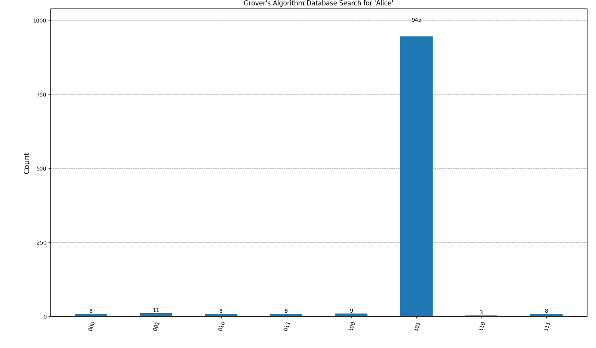
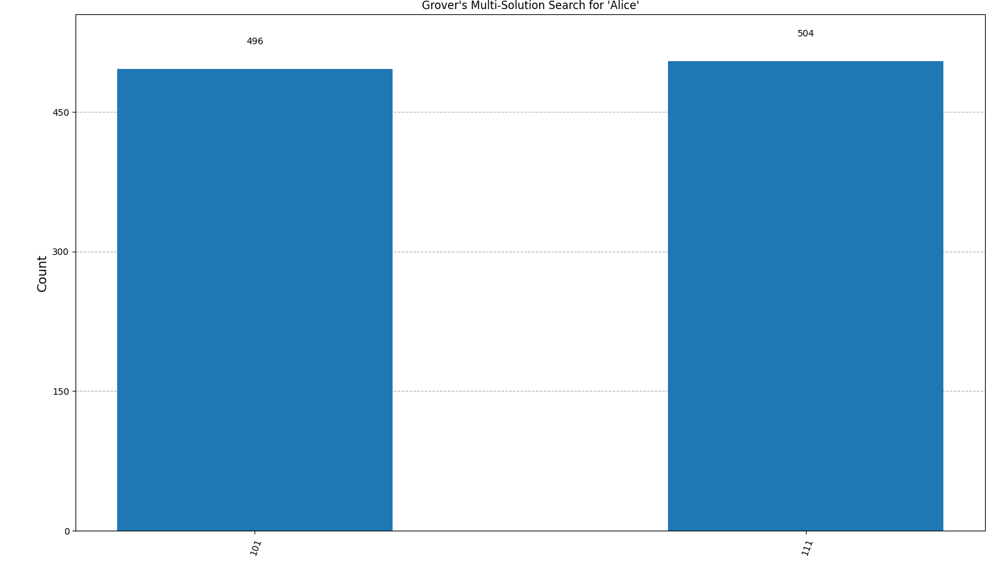

# Grover's Algorithm Quantum Database Search

## Overview
This project demonstrates Grover's algorithm using Qiskit to perform quantum search on an unsorted database. It includes both single-solution and multi-solution search, showing how quantum search can find one or all matching entries in a list. The code is modular, so you can use the core Grover's algorithm for other search or constraint satisfaction problems as well.

## What the Code Does
- **Implements Grover's algorithm** in a generic, reusable way (`grovers_algorithm.py`).
- **Single-solution search:** Finds the first occurrence of a target value in a database (Python list).
- **Multi-solution search:** Finds all occurrences of a target value in a database, amplifying all matching indices (`grovers_multi.py`).
- **Visualizes the results:** Prints measurement statistics and shows a histogram highlighting the correct answer(s).

## Implementation Details
- The core function `grovers_algorithm(n_qubits, marked_state, num_iterations=None)` implements Grover's algorithm for any marked state.
- The function `grovers_database_search(database, target)` adapts the algorithm to search for a target value in a Python list, mapping the value to its index and using Grover's algorithm to find it.
- The function `grovers_multi_solution_search(database, target)` marks all indices where the target appears and uses a multi-solution Grover's search to amplify all solutions.
- The code is modular: core logic, single-solution, and multi-solution search are in separate files for easy reuse and extension.

## File Structure
- `grovers_algorithm.py`: Core Grover's algorithm and single-solution search logic.
- `grovers_multi.py`: Multi-solution Grover's algorithm and search logic.
- `grovers_search.py`: Example script to run both single- and multi-solution searches.
- `requirements.txt`: Dependencies.
- `/images`: Example output histograms for single- and multi-solution search.

## Dependencies
- Python 3.8+
- [Qiskit](https://qiskit.org/) (core and Aer)
- numpy
- matplotlib

Install all dependencies with:
```bash
pip install -r requirements.txt
```

## How to Run
1. Clone this repository or copy the code files.
2. Install the dependencies as above.
3. Run the main search script:
   ```bash
   python grovers_search.py
   ```
4. The script will search for a target value (e.g., "Alice") in a sample database and display the results for both single- and multi-solution search.

## What Happens When You Run the Code
- The database is a Python list of names.
- The algorithm searches for the index (or indices) of a target name (e.g., "Alice").
- **Single-solution search:** Only the first occurrence is marked and amplified; the histogram shows one tall bar at that index.
- **Multi-solution search:** All occurrences are marked; the histogram shows tall bars at all matching indices.
- The results are printed as a table showing how many times each possible state (index) was measured, and a histogram is displayed.
- **The correct answer(s) appear as the tallest bar(s) in the histogram and the most frequent measurement(s).**
- Other states may still appear due to the probabilistic nature of quantum measurement, but with much lower frequency.

## Why Are There Only Bars for the Solutions in Multi-Solution Search?
- The multi-solution oracle marks all matching indices.
- Grover's algorithm amplifies the probability of measuring any of the marked states.
- The histogram shows a tall bar for each solution (matching index), and very low or zero bars for all other states.
- If there are two solutions, you will see two tall bars; if three, three bars, etc.

## Customization
- To search for a different value, change the `target` variable in `grovers_search.py`.
- To use a different database, modify the `database` list.
- To use Grover's algorithm for other problems, call `grovers_algorithm` or `grovers_multi_solution_algorithm` directly with your own oracle or marked state(s).

## Example Output
```
--- Single-Solution Grover's Search ---
Target 'Alice' is at index 5 (|101⟩)

Measurement results:
|101⟩ (index 5, 'Alice'): 850 times
...

--- Multi-Solution Grover's Search ---
Target 'Alice' is at indices [5, 7]:
  index 5 (|101⟩)
  index 7 (|111⟩)

Measurement results:
|101⟩ (index 5, 'Alice'): 480 times
|111⟩ (index 7, 'Alice'): 470 times
...
```
And a histogram will show the correct answer(s) as the tallest bar(s).

---

### Example: Single-Solution Search Histogram


### Example: Multi-Solution Search Histogram

